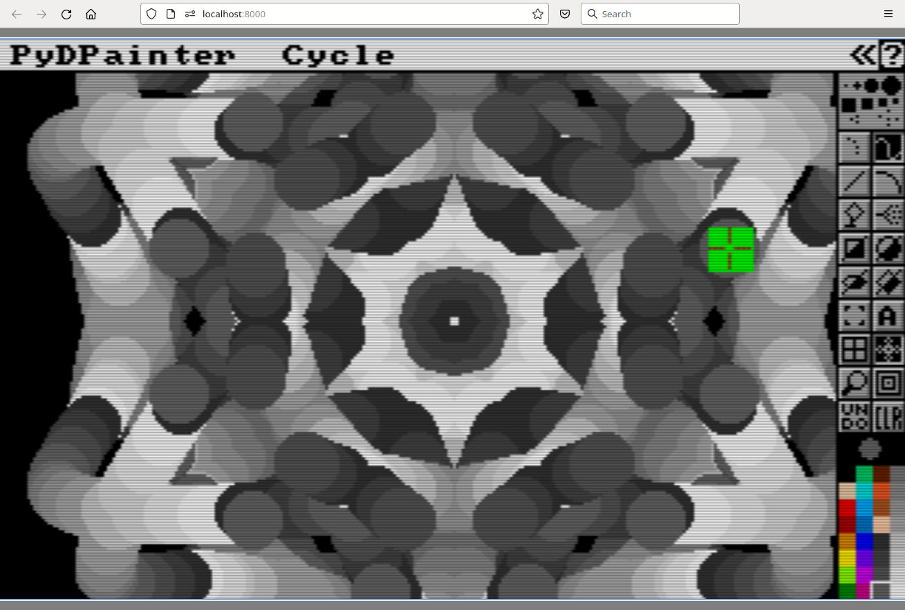

# Progress Update 2023-12-14

 [December 14, 2023](https://pydpainter.blogspot.com/2023/12/progress-update-2023-12-14.html "permanent link")

I have been making progress on a few things in the PyDPainter project:

## Running PyDPainter on the Web

I was able to get parts of PyDPainter to run on the web. Here is a screenshot of it running it in a web browser:

As you can see, the mouse pointer has a weird green block around it. Also, bringing up any requester freezes the program, so you can't load and save files for example. It's a start though, and I think it can get full functionality with some more work on it.

## Animation Features

 I've crossed off some things from my list in my last update:

-   ~~playback of animations~~
-   ~~fix the palette bugs that were introduced by having multiple palettes in animations~~
-   save numbered frames
-   save IFF ANIM
-   save GIF

The big things left are to allow for saving of animations now. I am contemplating whether to write my own animated GIF saver which probably will take a while and won't be very efficient or to use ImageMagik's animated GIF conversion. That would introduce another dependency which I don't really want to do.

I probably have to write an interface to deal with multiple palettes per animation, so I guess I have to add that to the list, too:

-   create palette key frame user interface

## Release 2.0.0 Projection

I am still on track to get version 2.0.0 out in early January. There will be no animbrush or move requestor functionality, but just basic animation capabilities. Other features to come later.
