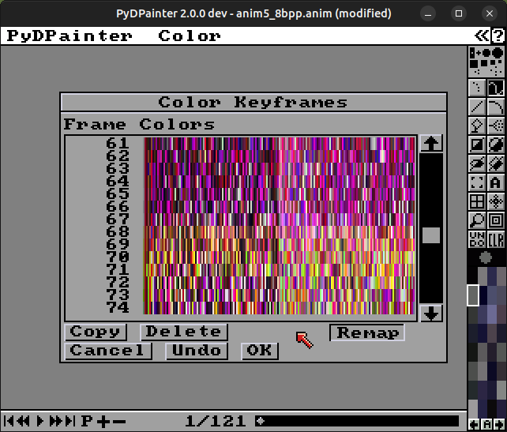

# GIFs are emanating and animating!

 [January 04, 2024](https://pydpainter.blogspot.com/2024/01/gifs-are-emanating-and-animating.html "permanent link")

## GIF Animation Saving

A milestone passed yesterday: animated GIF saving is working now in the development branch! As a bonus it also optimizes the file size by trying both the delta and the full image and seeing which compresses the smallest. The animated GIF loading which was previously added to the development branch now pairs perfectly with this feature.

## Numbered Animation Frame Export

This new feature on the development branch allows you to export the frames of an animation to individual image files so you can manipulate them however you want with other programs. It numbers each frame sequentially to keep them in order. There is also a new button added to the file requestors to make a directory to keep all the exported frames in one place. Of course the import functionality is still working on the development branch so you can import the frames back in again.

## Palette Key Frame GUI

There is now a new requestor that pops up when you have an animation and you click on the "P" icon in the anim toolbar at the bottom of the screen. This shows all the palettes in the frames of the animation and you can insert, copy, and delete palettes. It also includes a remap button to automatically remap the colors on the affected frames to their new palette.

## Summary

So these things are done for the 2.0.0 release:

- save numbered frames
- save GIF
- create palette key frame user interface  
    
These things still remain:

-   save IFF ANIM
-   user interface for editing frame delays
-   converting some of the picture manipulation menu items so they work with animations as well as single frames

The last two bullets I just added because I noticed they were missing.

  

I still hope to have version 2.0.0 out in the beginning of January.
