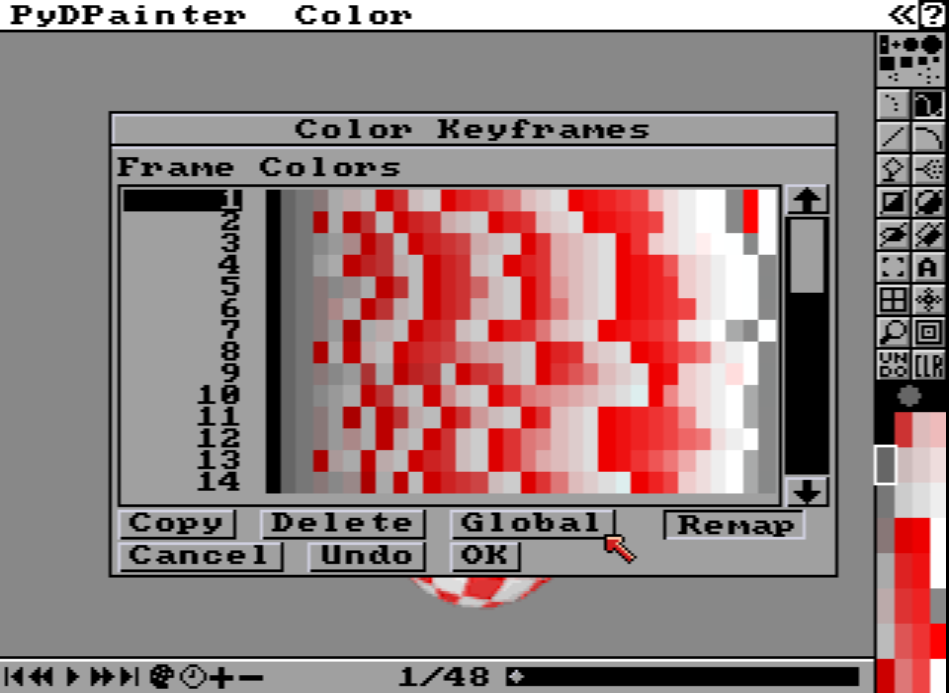
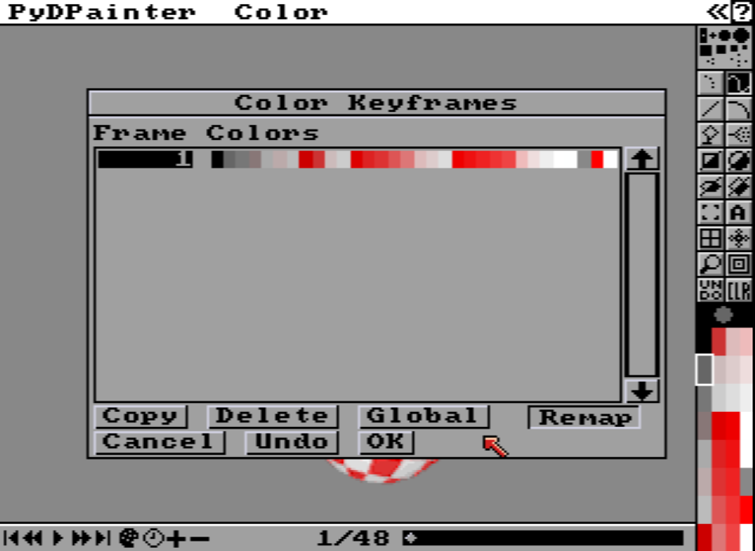

# Documentation, Saving IFF ANIM Files, and Fixing Animation Bugs

 [April 17, 2024](https://pydpainter.blogspot.com/2024/04/documentation-saving-iff-anim-files-and.html "permanent link")

## Documentation

There has been a lot of work done by Stephane Anquetil to fill in the major gaps I had in the documentation. In fact the very first documentation page (the Picture menu) was pretty much just a placeholder I made until Stephane filled in all the descriptions along with examples and helpful screenshots. Thanks so much for your contributions! The documentation is here on the PyDPainter web site:

[https://pydpainter.org/docs/TOC.md](https://pydpainter.org/docs/TOC.md)

##  IFF ANIM support

The development of the PyDPainter code has also been continuing, albeit a bit more slowly than I would like. One of the big changes I have recently implemented in the "develop" branch is the saving of IFF ANIM files in addition to the animated GIF support I had already implemented. There are a few different types of IFF ANIM files, but most of the older (non-AGA) files are ANIM-5 format. The later ANIM-7 and ANIM-8 formats worked faster (especially on 68030 and 68040 machines) by copying data in larger chunks. For now, PyDPainter can only load and save ANIM-5 files and only up to 256 colors -- HAM and HAM-8 are not currently supported. I plan to add support for the ANIM-7 and ANIM-8 variants at some point and hope to also add conversion of HAM and HAM-8 mode to 256 color mode.  

To save an ANIM-5 file, use the Anim/Save menu option and make sure the file extension is ".anim". You can also still save as ".gif" as well. I'll add a drop-down menu for the file extension in the future to make this discoverable.  

## Extending code to work with animations

When adding animation features, a lot of stuff stopped working right. I still haven't recovered from all the breakages yet, so that's why I haven't released a new version. Two of the worst offenders were: Screen Format and Page Size. Before I fixed them, they would only operate on one frame of an animation and could cause it to crash or just get really buggy. Now you can change any of these and it will apply to all the frames:

-   Screen Format requestor:  
-   Screen mode (PAL, NTSC, or VGA)  
-   Screen resolution (with resizing)  
-   Number of colors (more colors or less with remapping)
-   Page Size requestor:
-   Size of canvas (with scaling or cropping)

These operations produce a progress bar and show the frames as they're being converted.

## Color Keyframes - Global button  

Animations can have a global color palette for the whole animation, palette changes throughout the animation, or even a palette for every frame. The Color Keyframes button in the animation toolbar brings up a requestor that now has a new "Global" button:

Clicking the "Global" button will convert the animation to a global palette:

Clicking "OK" applies that single palette to all frames and also remaps them.

## What's Next

Here are some things on my to do list:

-   fix Background and Stencil to work with animations
-   add dropdown (with GIF and ANIM) for animation file saving
-   add Move requestor
-   add anim brushes
-   fix any bugs that crop up
